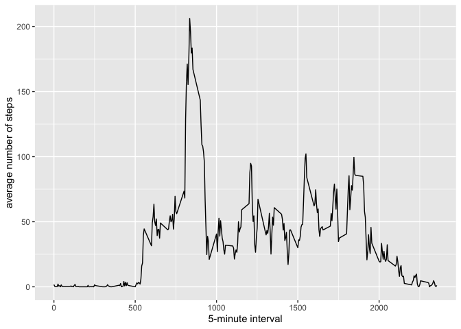
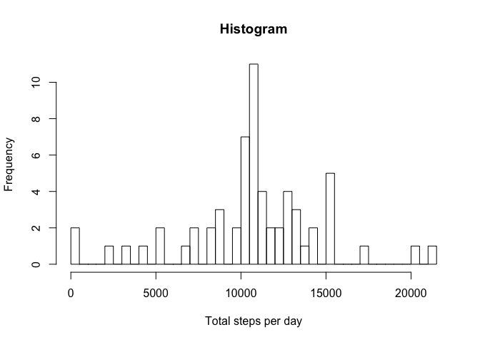
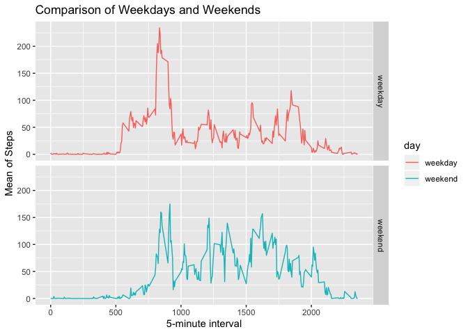

## Loading and preprocessing the data


```r
library(ggplot2)
```

```
## Warning: package 'ggplot2' was built under R version 3.5.3
```

```r
library(dplyr)
```

```
## Warning: package 'dplyr' was built under R version 3.5.3
```

```
## 
## Attaching package: 'dplyr'
```

```
## The following objects are masked from 'package:stats':
## 
##     filter, lag
```

```
## The following objects are masked from 'package:base':
## 
##     intersect, setdiff, setequal, union
```

```r
data <- read.csv("activity.csv")
```

## What is mean total number of steps taken per day?


```r
#dplyr group_by function
data_perday <- data %>% 
  group_by(date) %>% 
  summarize(sum_steps = sum(steps,na.rm = TRUE))

# histogram 
hist(data_perday$sum_steps, xlab = "Total steps per day",main="Histogram",breaks = 50)
```

<!-- -->

```r
mean(data_perday$sum_steps)
```

```
## [1] 9354.23
```

```r
median(data_perday$sum_steps)
```

```
## [1] 10395
```

## What is the average daily activity pattern?


```r
data_interval <- data %>% 
  group_by(interval) %>% 
  summarize(mean_steps = mean(steps,na.rm = TRUE))

ggplot(data_interval, aes(x=interval, y=mean_steps)) + geom_line() + xlab("5-minute interval") + ylab("average number of steps")
```

<!-- -->

```r
data_interval[which(data_interval$mean_steps == max(data_interval$mean_steps)),]
```

```
## # A tibble: 1 x 2
##   interval mean_steps
##      <int>      <dbl>
## 1      835       206.
```


## Imputing missing values

```r
# How many missing values 
sum(is.na(data))
```

```
## [1] 2304
```

```r
# Function to replace NA
replacefunction <- function(x) replace(x, is.na(x), mean(x, na.rm = TRUE))
data_new <- data %>% 
  group_by(interval) %>% 
  mutate(steps = replacefunction(steps))
  
#dplyr group_by function
data_new_perday <- data_new %>% 
  group_by(date) %>% 
  summarize(sum_steps = sum(steps,na.rm = TRUE))

# histogram 
hist(data_new_perday$sum_steps, xlab = "Total steps per day",main="Histogram",breaks = 50)
```

<!-- -->

```r
mean(data_new_perday$sum_steps)
```

```
## [1] 10766.19
```

```r
median(data_new_perday$sum_steps)
```

```
## [1] 10766.19
```
Do these values differ from the estimates from the first part of the assignment? What is the impact of imputing missing data on the estimates of the total daily number of steps?

## Are there differences in activity patterns between weekdays and weekends?

```r
weekdayornot <- function(date) {
    day <- weekdays(date)
    if (day %in% c("Monday", "Tuesday", "Wednesday", "Thursday", "Friday"))
        return("weekday")
    else if (day %in% c("Saturday", "Sunday"))
        return("weekend")
    else
        stop("invalid date")
}

data$date <- as.Date(data$date)
data$day <- sapply(data$date, FUN = weekdayornot)
mean_data <- data %>% group_by(interval,day) %>% summarise(aver = mean(steps, na.rm = TRUE))
head(mean_data)
```

```
## # A tibble: 6 x 3
## # Groups:   interval [3]
##   interval day      aver
##      <int> <chr>   <dbl>
## 1        0 weekday 2.33 
## 2        0 weekend 0    
## 3        5 weekday 0.462
## 4        5 weekend 0    
## 5       10 weekday 0.179
## 6       10 weekend 0
```

```r
ggplot(mean_data, aes(x=interval, y=aver, color=day)) + geom_line()+
facet_grid(day ~.) + xlab("5-minute interval") + ylab("Mean of Steps") +
    ggtitle("Comparison of Weekdays and Weekends")
```

<!-- -->
